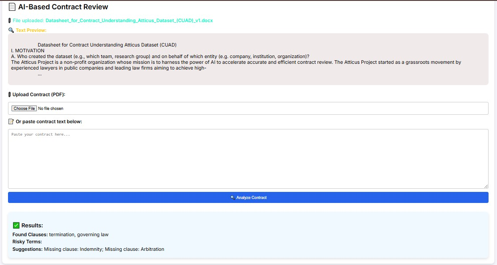

# 🧠 AI-Based Contract Review System


A web-based legal contract analyzer using NLP (spaCy). Upload a PDF or paste a contract — the app will extract clauses, detect risky terms, and give feedback.

## 🚀 Features

- 📄 Upload PDF contracts or paste plain text
- 🔍 Extracts legal clauses (termination, indemnity, etc.)
- ⚠️ Flags risky legal terms
- 💡 Suggests missing clauses

## 🛠 Tech Stack

- Python + Flask (Backend)
- spaCy (NLP)
- PyMuPDF (PDF parsing)
- HTML/CSS (Frontend)

## 📦 Installation

```bash
git clone https://github.com/your-username/ai-contract-review.git
cd ai-contract-review
pip install -r requirements.txt
python -m spacy download en_core_web_sm
